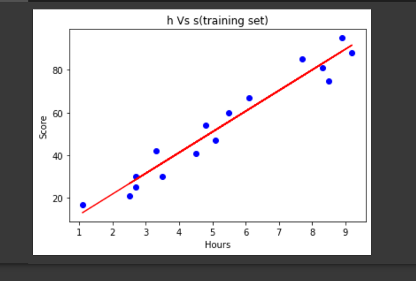

# Implementation-of-Simple-Linear-Regression-Model-for-Predicting-the-Marks-Scored

## AIM:
To write a program to implement the simple linear regression model for predicting the marks scored.

## Equipments Required:
1. Hardware – PCs
2. Anaconda – Python 3.7 Installation / Moodle-Code Runner

## Algorithm
1.  To implement the linear regression using the standard libraries in the python. 
2.  Use slicing function() for the X,y values.
3.  Using sklearn library import training , testing and linear regression modules.
4.  Predict the value for the y. 
5.  Using matplotlib library plot the graphs.
6.  End the program.


## Program:
```
/*
Program to implement the simple linear regression model for predicting the marks scored.
Developed by: 
RegisterNumber:  
*/
import numpy as np
import pandas as pd
import matplotlib.pyplot as plt
data=pd.read_csv("/content/student_scores - student_scores.csv")
data.head()
data.isnull().sum()
x=data.Hours
x.head()
y=data.Scores
y.head()
n=len(x)
m=0
c=0
l=0.001
loss=[]
for i in range(10000):
    ypred=m*x+c
    MSE=(1/n)*sum((ypred-y)*2)
    dm=(2/n)*sum(x*(ypred-y))
    dc=(2/n)*sum(ypred-y)
    c=c-l*dc
    m=m-l*dm
    loss.append(MSE)
    #print(m,c)
    ypred=m*x+c
plt.scatter(x,y,color="blue")
plt.plot(x,ypred)
plt.xlabel("study hours")
plt.ylabel("scores")
plt.title("study hour vs scores")
plt.plot(loss)
plt.xlabel("iteration")
plt.ylabel("loss")
    
```

## Output:



## Result:
Thus the program to implement the simple linear regression model for predicting the marks scored is written and verified using python programming.
