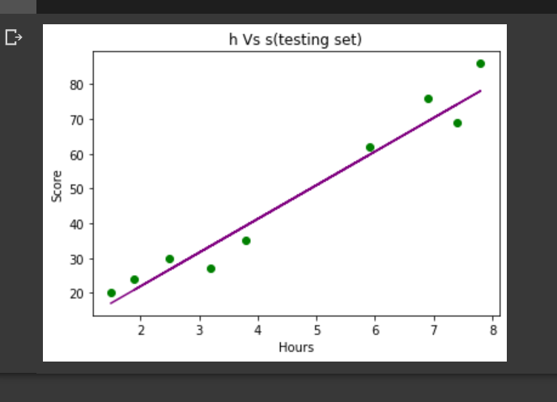

# Implementation-of-Simple-Linear-Regression-Model-for-Predicting-the-Marks-Scored

## AIM:
To write a program to implement the simple linear regression model for predicting the marks scored.

## Equipments Required:
1. Hardware – PCs
2. Anaconda – Python 3.7 Installation / Moodle-Code Runner

## Algorithm
1.  To implement the linear regression using the standard libraries in the python. 
2.  Use slicing function() for the X,y values.
3.  Using sklearn library import training , testing and linear regression modules.
4.  Predict the value for the y. 
5.  Using matplotlib library plot the graphs.
6.  End the program.


## Program:
```
/*
Program to implement the simple linear regression model for predicting the marks scored.
Developed by: ILAYARAJA.M
RegisterNumber:212221040057  
*/
import numpy as np
import pandas as pd
import matplotlib.pyplot as plt
navu=pd.read_csv('/content/student_scores - student_scores.csv')
navu.head()
X=navu.iloc[:,:-1].values
X
y=navu.iloc[:,1].values
y
from sklearn.model_selection import train_test_split
X_train,X_test,y_train,y_test=train_test_split(X,y,test_size=1/3,random_state=0)
from sklearn.linear_model import LinearRegression
regressor=LinearRegression()
regressor.fit(X_train,y_train)
y_pred=regressor.predict(X_test)
y_pred
y_test
plt.scatter(X_train,y_train,color='blue')
plt.plot(X_train,regressor.predict(X_train),color="brown")
plt.title("h vs s (Training Set)")
plt.xlabel("Hours")
plt.ylabel("Scores")
plt.show()
plt.scatter(X_test,y_test,color='black')
plt.plot(X_test,regressor.predict(X_test),color="orange")
plt.title("h vs s (Testing Set)")
plt.xlabel("Hours")
plt.ylabel("Scores")
plt.show()


    

Output:

    
```

## Output:




## Result:
Thus the program to implement the simple linear regression model for predicting the marks scored is written and verified using python programming.
